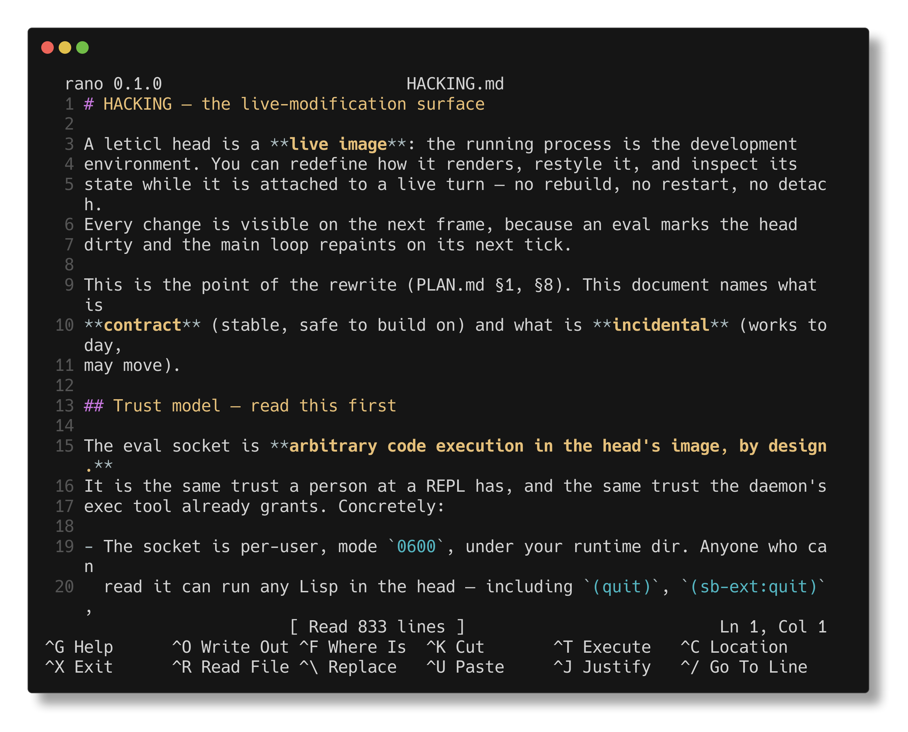

# rano

A nano clone for the terminal, written in Rust. Built on
[crossterm](https://crates.io/crates/crossterm) (raw mode, key events) and
[ratatui](https://crates.io/crates/ratatui) (rendering), with tree-sitter
syntax highlighting and a minimal LSP client.



## Install

```sh
curl -fsSL https://raw.githubusercontent.com/deadtrickster/rano/master/install.sh | sh
```

One line. It downloads the prebuilt binary for your platform from the
[latest release](https://github.com/deadtrickster/rano/releases/latest) and puts
it in `~/.local/bin` — no toolchain needed. Prebuilt for Linux x86_64/aarch64 and
macOS arm64/x86_64.

If there is no asset for your platform it falls back to building from source,
which needs [Rust](https://rustup.rs) and a C compiler (the tree-sitter grammars
are C). It says which one is missing rather than letting cargo fail in its own
words. `RANO_INSTALL_DIR` puts the binary elsewhere; `RANO_FROM_SOURCE` skips the
download and always builds; `RANO_VERSION` selects a tag.

The script is [`install.sh`](install.sh) in this repo — short, and worth reading
before you pipe a URL into a shell.

If you already have Rust, the same thing from source in one command:

```sh
cargo install --git https://github.com/deadtrickster/rano.git
```

### Build

From a checkout:

```sh
cargo build --release
./target/release/rano [options] [file]
```

## Usage

```
rano [options] [file...]

  -l, --line N      put the cursor on line N (1-based) and centre it
  -c, --column N    put the cursor on column N (1-based)
  -f, --follow      open at the tail, and keep reading the file as it grows
                    (all three apply to the first file)
  file:LINE[:COL]   open that file at that position (any file, not just the first)
  +LINE[,COL] file  the same, nano/vi style, for the file after it
  -h, --help        usage
  -V, --version     the version

  --export FORMAT [file]   colourise to stdout and exit, no terminal needed
                           (html, ansi, markdown, text)
```

Opens `file` if it exists, otherwise starts a new buffer that will be saved
under that name. No arguments starts an empty buffer.

Several files open one buffer each, the first one current: `rano src/*.rs`.
The others are read the first time you switch to them, so naming twenty files
costs one read and one language server up front. Naming more than one file
turns `multibuffer` on for the session. See [Buffers](#buffers).

`--line` and `--column` open at a position, which is what makes `rano` usable
as somebody else's `$EDITOR`: a compiler error, a grep hit or a stack trace
gives you a line, and the line is centred rather than at the top edge so you can
see its context. Both accept `=` (`--line=42`) and short forms (`-l 42`).

For a big file the position is applied when that row arrives, not at startup —
rows stream in, so `--line 1000000 huge.log` waits for line 1000000 rather than
opening at whatever had been read. A bad flag or an unreadable file prints a
message and exits non-zero, so a caller can tell what happened.

### `-f`, which is how you read a log

`rano -f huge.log` opens at the **tail**: the last screenful, found by scanning
backwards from the end, so a 2 GiB log opens for a read of a few hundred KiB
rather than the whole file. It then **follows** — new lines appear as whatever
is writing the file writes them — and it opens **read-only**, because a tailed
file is one another process owns: an edit that could not be saved is work lost
silently, so typing is refused at the keystroke and says why.

A row appears only once the file has finished writing it: a trailing partial
line is held back until its newline arrives, so half a stack trace is never
shown as if it were whole. The line numbers are the FILE's, counted in the
background while you look at the buffer — until that count answers, the gutter is
blank and the status line says `Ln ?`, because a tail's row 1 is not the file's
line 1 and guessing it would be a lie.

Measured on one 344 MB log of 4 000 000 rows: **5 MB of memory**, against 1.6 GB
for the same file opened normally. A follower with nothing new to read costs
nothing measurable (one `read` per 100 ms), and a view you have scrolled away
from is left where you put it — following a file is not a licence to move your
screen.

## Keys

### Finding a command

There are too many keys to remember, so rano helps you find them, the emacs way:

- **`M-x`** runs any command by name. Type a few letters of what you want, in
  any order (`wri out` finds Write Out). Recently run commands come first, and
  every row shows the command's key, so the palette also teaches the keys.
- **`^G`** (or `F1`) is the help prefix, and its card shows as soon as you
  press it: `?` (or `^G` again) for the help page, `k` then any key to see
  what that key runs, `b` for every key in effect, `x` for `M-x`.
- **Prefix keys** show a card of what can follow if you pause after them:
  `M-t` for todo lists, and the help prefix at once. `Esc` abandons a prefix.
- **The bottom bar follows what you're doing.** In the text it shows the
  main keys; in a list, a diff, a help page or `M-x`, it shows that view's
  keys; after a prefix, what can follow it.

Every key's meaning is written down once, in a table of named commands and the
keymaps that reach them (`src/commands.rs`, and `rano::keymap` for the
keymaps), and the bar, the help pages, `M-x` and the cards all read from it.
Keys are written emacs-style by default (`C-x`, `M-p`); `key_notation = nano` in
the config writes them nano's way (`^X`, `M-P`).

| Key | Action |
|---|---|
| `M-X` | Run a command by name |
| `^G` / `F1` | Help prefix: `?` help page, `k` describe a key, `b` every key, `x` run a command |
| `^O` / `F2` | Write out (save) |
| `^R` / `F5` | Read a file into the buffer |
| `^F` / `F3` | Where is (search); `^B` searches backwards |
| `M-B` / `M-F` | Jump to previous / next match |
| `M-C` / `M-R` | In the search prompt: toggle case sensitivity / regex |
| `^\` / `F4` | Replace (y/n/a/q per match; `a` replaces from the cursor on) |
| `^T` / `F6` | Execute shell command (stdout inserted async on success) |
| `M-\|` | Filter the marked region through a shell command |
| `M-U` | Undo (runs of the same action coalesce into one step) |
| `M-E` | Redo |
| `^K` | Cut line / marked region (repeat to cut more lines) |
| `^U` | Paste (nano's "Un-Cut") |
| `M-6` | Copy current line / marked region to the cutbuffer (no delete) |
| `^D` | Delete char (remembered for `^U`) |
| `M-A` / `^A` | Set/unset mark (selection) |
| `M-]` | Jump to matching bracket |
| `^/` / `F11` | Go to line |
| `M-D` | Jump to next diagnostic (wraps) |
| `M-.` | Jump to definition (LSP) |
| `M-?` | Find usages (LSP references): list them, Enter jumps to one |
| `M-,` | Jump back (stacked — one press per jump, from a definition or a usage) |
| `M-V` | Install the newer release the startup check found |
| `M-T T` | Tick the task on this line (`[ ]` ↔ `[x]`) |
| `M-T C` | Tick every task in this section — or in this task's subtree |
| `M-T X` | Decline the task on this line (`[-]`), or un-decline it |
| `M-}` / `M-T ]` | Jump to the next heading |
| `M-{` / `M-T [` | Jump to the previous heading |
| `M-N` | Toggle line-number gutter |
| `M-\` | Toggle soft line wrap (long lines wrap at the viewport edge) |
| `F8` | Open file (new buffer when `multibuffer`, else replaces current — unless it has unsaved edits, which keeps it); `name:line[:col]` jumps there |
| `M-<` / `M->` | Previous / next buffer |
| `M-L` | Buffer list (Enter switches, `Del` closes the selected buffer) |
| `M-P` | Preview a diff/patch buffer, a markdown file as prose with its pictures, a picture as a picture, or a file's merge conflicts side by side |
| `M-S` | Send the file, cursor and selection to `send_command` (see [Talking to a host](#talking-to-a-host)) |
| `M-W` | Close the current buffer (asks to save it if modified) |
| `F9` | Sort lines (whole buffer, or marked region) |
| `^J` / `F10` | Justify current paragraph |
| `F7` | Make backup (`file~`) |
| `^C` | Show line/column |
| `^X` | Exit (asks to save each modified buffer in turn) |

Movement: arrows, `Home`, `End`, `PgUp`, `PgDn`, `^P`/`^N` (line), `^E` (end
of line), `Alt+Left`/`Alt+Right` or `Ctrl+Left`/`Ctrl+Right` (word), `◂`/`▸`
for back/forward in prompts. Mouse: left click moves the cursor, and a click
*on* the cursor toggles the mark (nano's gesture — then a drag or the arrows
extend the selection); left drag selects from where it was pressed. The wheel
scrolls the view — the preview of a file, or the text (where the cursor stays
put unless the scroll would push it out of sight). Editing: `Enter`,
`Backspace`, `Delete`, `Tab`.
`Tab` follows the buffer's own indent style: space-indented files get spaces
up to the next unit boundary (the unit is detected from the file — e.g.
rano's own 4-space source), tab-indented files get a tab char; `Backspace`
on leading whitespace eats a whole unit. `Esc` clears an active mark or
cancels a prompt (`^G` also cancels prompts).

Prompts: `Up`/`Down` cycle history (search, exec, and filename prompts keep
separate histories), `Tab` completes file names, `~` expands to `$HOME` in
filename prompts, `M-b`/`M-f` move by word.

Bracketed paste is supported: multi-line pastes arrive as a single undoable
edit.

### Files changed on disk

rano does not watch files. When you save over a file that something else has
written since rano read it (its size or modification time differ), it asks
first: `y` overwrites, `n` (or `^G`) doesn't save, and `d` shows what the save
would change: the file on disk against the buffer, unified or in two panels
(`s` switches, and the choice sticks for the session), with line numbers, the
changed words emphasised and the code syntax-coloured in the two-panel view. In
the diff, the arrows, `PgUp` / `PgDn` / Space, `Home` / `End` scroll, `y` / `n`
answer, and Esc goes back to the question. A save that was part of `^X` or `M-W`
is called off by `n`.

The diff renderers are part of rano's library (`rano::diff`, `rano::sidediff`),
drawing ratatui lines, for other programs that show text the same way.

### Preview: diffs, markdown, pictures, merge conflicts

`M-P` draws the current buffer over the text, using the same renderers as the
save diff above, and `M-P` or Esc goes back to the text. Only resolving a
conflict from the view (below) changes the text — a preview is a view of what
the buffer holds, not an edit of it.

- **A diff or patch** (`.diff`, `.patch`, or any buffer holding `git diff` /
  `diff -u` output) is shown file by file and hunk by hunk, numbered by each
  file's own lines, with changed words emphasised. The commit message and
  `format-patch` signature are shown dimmed.
- **A markdown file** (`.md`, `.markdown`) is drawn as the prose it documents:
  headings, lists, quotes and tables laid out at the width, emphasis and code
  spans in their own colour, and a fence syntax-highlighted in the language it
  names. **The pictures it names are drawn too** — `` renders as
  the image, under the line the reference is on, resolved relative to the file
  (a `~/` path or an absolute one as written). A reference that cannot be read
  draws nothing and says nothing: the alt text is what is left of it. This view
  is one column, so `s` says there is nothing to split rather than doing nothing.
- **A picture file** (`.png`, or anything a converter on the machine can turn
  into one — a JPEG, a GIF, an SVG) **opens as the picture**: not as the text of
  its bytes, which is a lossy decode of something that is not text and no reading
  at all. Esc (or `M-P`) **closes that buffer**, and when it is the only one the
  picture stays and says so — the bytes of a PNG are not what you are being
  taken back to. It is drawn at a box that follows the window: half its width,
  and narrower in a narrow pane; a resize redraws it at the new box. Pictures
  need a terminal that takes inline images (the kitty graphics protocol):
  Ghostty does, and `RANO_TERM_FEATURES=images` turns them on anywhere else.
  Without one the file is read as text and nothing is said about it — `M-P` says
  why.
- **A file with merge conflicts** (`<<<<<<<` / `=======` / `>>>>>>>`, with or
  without diff3's `|||||||` base) is shown one conflict per section, with ours
  and theirs lined up and the surrounding lines of the file for context. Each
  side is numbered by its own version of the file. In this view:
  - `n` / `p` (or `]` / `[`) go to the next / previous conflict;
  - `o` takes ours, `t` theirs, `b` both (ours first), `B` both (theirs
    first) — each one undo step (`M-U`), and the view moves on to what is
    left, closing when nothing is;
  - `c` cycles the comparison: ours against theirs, then base against ours and
    base against theirs — what each side changed — when the base was recorded
    (`git config merge.conflictStyle diff3`).

`s` switches between unified and two panels, and the choice sticks for the
session. Both are syntax-coloured in the file's language.

A preview is not a place with no way out: `F8` (open file), `M-W` (close the
buffer), `M-<` / `M->` (previous / next buffer) and `M-x` reach through it, and
anything that makes another buffer current closes the view with it.

#### Pictures in other formats

The terminal's protocol carries PNG, so anything else is converted first by a
converter on your machine — ImageMagick (`magick` or `convert`), macOS's `sips`,
`ffmpeg`, or Python with Pillow, in that order, whichever is installed. rano
carries no decoder and no rasterizer of its own: that is a decision with its
numbers in `TODO.md` (§19.2 — a bundled SVG rasterizer was +2.4 MiB), and a
machine with a converter gets JPEG, GIF, WebP, TIFF, SVG and the rest for free,
including SVG, which draws wherever the converter can rasterize it.

A conversion is asked to fit the box the picture will be drawn in, and it is
watched while it runs: two seconds, 256 MiB of memory (sampled as it goes, and
capped by the kernel as well where the kernel keeps one), and 32 MiB written. A
converter that passes any of those is killed and said to have been — this is a
convenience, and one that hangs the editor is worth less than the picture.
`RANO_IMAGE_CONVERT` names a converter yourself (a command line with `{in}`,
`{out}`, `{w}`, `{h}`, `{max}`); an empty one turns conversion off.

## Buffers

With `multibuffer = true` (or more than one file on the command line) every
file you open gets its own buffer, with its own cursor, undo history and
language server:

- `F8` opens a file in a new buffer, or switches to it if it is already open.
- `M-<` / `M->` cycle through buffers. `M-L` lists them: the arrows, `PgUp` /
  `PgDn`, `Home` / `End` move, Enter switches, `Del` closes the selected one, and
  Esc leaves the list.
- `M-W` closes the current buffer. A modified buffer asks first: `y` saves and
  closes, `n` discards and closes. The last buffer stays open; `^X` exits.
- `^X` offers each modified buffer for saving in turn, then exits.

Jumps go through the same buffers:

- `M-.` (definition) into a file that is already open switches to that buffer,
  unsaved edits and all, rather than reading a second copy from disk.
- `M-?` (usages) lists every reference to the symbol under the cursor as
  `file:line:col  text`, grouped by file. The text comes from the open buffer
  when there is one, so unsaved edits show. Enter jumps there like `M-.` does.
- `M-,` unwinds either kind of jump, back into the buffer you started from.

## Todos

Open a file named `TODO.md` and the checkboxes are live. It is the
[todo-md](https://github.com/todo-md/todo-md) markdown standard: three states,
`- [ ]`, `- [-]`, `- [x]`, and subheaders as sections.

The todo keys are under the `M-T` prefix (pause after it to see them):

| key | what it does |
|---|---|
| `M-T T` | Tick the task on this line. `[ ]` → `[x]`, and back. |
| `M-T C` | Tick every task in the section the cursor is in — or, on a task line, in that task's subtree. Press again to clear. |
| `M-T X` | Decline: `[-]`. Press again to un-decline. |

**`[-]` means declined, not "in progress".** That is the standard's own word —
its states are *"open / declined / done / deleted"* — and it is why it has its
own key: the everyday press never passes through it by accident.

**A parent follows its children.** Completing the last sub-task completes the
parent, and un-completing one opens it again, because the file is the thing
other tools read and a parent left `[x]` above an open child is the file
disagreeing with itself. That is also why `M-T T` on a task that *has* children
carries them: `[x]` on the parent would otherwise be a state the file cannot
keep.

**Nothing but markers is ever written.** A tick rewrites three bytes and leaves
every other byte of the file alone — the prose between tasks, your metadata
tails (`~3d #feat @john 2020-03-20`), wrapping and trailing whitespace are not
parsed, not modelled, and not rewritten. Verified on a real file: ticking two
tasks in a section changes exactly those two lines and the file stays the same
size.

**Heading motion** (`M-}` / `M-{`) walks the outline, wrapping at the ends and
saying so. Headings are markdown's, not the todo standard's, so it works in any
markdown file — heading motion is not gated on the file name the way the marker
check is.

**A marker the standard does not define is reported**, in the gutter, in the
same red an error gets: `- [/]` is not one of the three, and neither the grammar
nor a plain markdown reader will tell you. In a file that is not `TODO.md` the
editor stays out of it — `[-]` in somebody else's markdown is theirs to write.

## Talking to a host

rano can be told where to go, and can say where you are.

**Going somewhere.** `rano src/main.rs:120:5`, `rano +120 src/main.rs`, and
`src/main.rs:120` at the `F8` prompt all open the file with the cursor on that
line, centred. A file that is already open is switched to rather than read
twice. In code, a host that owns the editor calls
`Editor::open_at(path, line, column)`. If the current buffer has unsaved edits,
the file opens in a new buffer even without `multibuffer`, so a jump never
throws edits away.

**Sending your place.** `M-S` hands the host a `rano::send::SendEvent`: the
file's absolute path, the cursor, the selection (start, end and text) when a
mark is set, and whether the buffer has unsaved edits. Lines and columns are
1-based and count characters. A host sets `Editor::on_send` to a callback. The
standalone binary runs `send_command` with `sh -c`, the event as one line of
JSON on stdin, and `RANO_FILE`, `RANO_LINE` and `RANO_COLUMN` in its
environment:

```json
{"path":"/src/main.rs","cursor":{"line":120,"column":5},"selection":{"start":{"line":118,"column":1},"end":{"line":120,"column":5},"text":"..."},"modified":false}
```

rano doesn't wait for the command, and its output is discarded (the terminal
belongs to the editor), so the status line only says the event was sent.

## Embedding

The editor is a library too (`rano::editor`), so another program can show it
as a pane rather than run it as a second process. A host builds an `Editor`,
gives it its place with `set_area`, opens files with `open_at(path, line,
column)`, feeds it keys, mouse events and pastes, calls `tick` between events
and draws it with `rano::ui::draw_in` into its pane's rectangle.
`next_wakeup` says how long the host may wait for input before ticking again.
`handle_key` says whether the editor used a key; a host stacks its own chords
over the editor's with `push_keymap`, and a chord bound to a name the editor
does not know comes back to the host by that name. `wants_quit` turns true
when the editor exits. The `rano` binary is one such host.

## Configuration

`$XDG_CONFIG_HOME/rano/config.toml` (falling back to `~/.config/rano/config.toml`):

```toml
tab_width = 8      # 1..=16, tab rendering + horizontal scrolling
auto_indent = true
line_numbers = true
multibuffer = false # F8 pushes a new buffer instead of replacing the current one
wrap = true         # soft line wrap (M-\ toggles at runtime)
autoupdate = true   # check GitHub for a newer release at startup
send_command = "my-tool --from rano"  # what M-S runs; quote it to keep a '#'
```

The todo keys need no configuration: they act on a line that has a task marker,
in any markdown file. Checking and reporting are scoped to `TODO.md` by name.

Unknown keys are ignored; out-of-range values fall back to the defaults.

`autoupdate` is a switch rather than a value: unset means "decide by
`RANO_AUTOUPDATE`", and with neither it is **on**, as update checks are in normal
software. Set `autoupdate = false`, or `RANO_AUTOUPDATE=0` in the environment, to
turn it off.

### A note on the download size

The binary is ~19 MB on disk, ~3.4 MB as the release archive. **Three quarters of
it is the 28 tree-sitter grammars** — 14.5 MB of `ts_parse_table` /
`ts_small_parse_table` symbols, measured with `nm`. Those are `const` C arrays, so
no compiler flag shrinks them and stripping saves only ~5%; the size IS the
language support. The release profile does what it honestly can (`strip`, `lto`,
`codegen-units = 1`: 20.3 MB → 18.7 MB, measured, with typing speed unchanged at
0.1 µs on a 193 MB file). If the size ever matters more than the languages, the
lever is dropping grammars — a feature decision, not a build one.

### Updates

With it on, rano makes one request to the GitHub releases API at startup, on a
background thread, and compares the tag with its own version. If there is a
newer release it says so, and `M-V` installs it — replacing the binary in place,
which takes effect on the next start. Nothing is downloaded until you press it.

The request is off-thread, so a slow or absent network costs a frame nothing. A
failed check is silent: an unreachable GitHub is not an editor's problem.

Downloads are HTTPS-only and certificate verification is **not** negotiable —
curl is run with `-q`, which stops `~/.curlrc` being read at all, because a
single `insecure` line there would otherwise turn verification off for every
download. Both the request and any redirect must be HTTPS. `install.sh` uses the
same flags.

## Notes

- The look follows nano's default theme: an inverted title bar (name,
  centered file name + ` *` when modified, `[i/n]` buffer position), an
  inverted status line (centered messages, right-aligned prompts, and the
  cursor's `Ln X, Col Y` at the right edge when idle), and a two-line
  inverted function bar. The bar, the help overlay, and their key labels
  are all generated from one binding table, so they cannot drift.
- Syntax highlighting via tree-sitter for Rust, Go, Bash, Python, C, JSON,
  Common Lisp, JavaScript, TypeScript (+TSX), Markdown, TOML, YAML, HTML,
  CSS, Lua, Ruby, PHP, Java, Make, Dockerfile, INI-style configs, diffs,
  Elisp, Scheme, SQL and Clojure — detected by file extension, by
  conventional file names (`Makefile`, `Dockerfile`, `.gitconfig`), and by
  shebangs for extension-less scripts.
  Scratch buffers are not highlighted. Search
  matches, the selection, and diagnostics take priority over highlight
  colors (diagnostics underline the offending range in red/yellow/blue; the
  line-number gutter colors diagnostic rows the same way).
- Syntax errors are visible without a language server: tree-sitter `ERROR`
  and missing nodes become red diagnostics on every re-parse. Zero-width
  LSP diagnostics (rust-analyzer's insertion-point errors) are widened to
  one visible column. Language servers only fully engage inside a supported
  project (e.g. a `Cargo.toml` for rust-analyzer); standalone files get
  tree-sitter feedback only.
- Live completion (LSP): typing an identifier, or `.` / `::` after one,
  requests `textDocument/completion` and shows a popup below the word
  (above it near the bottom). The server's own filtered, relevance-ordered
  list is shown as-is in an 8-row scrolling window — fuzzy matches keep
  the server's ranking. `Up`/`Down` or `^P`/`^N` pick, `Enter` or `Tab`
  insert, `Esc` dismisses; typing and Backspace keep it open. The document
  is synced to the server before each request, each response is matched to
  the keystroke that asked for it (late answers for older typing are
  dropped), and snippet placeholders are flattened to plain text.
- LSP: when a language server is on `$PATH` (rust-analyzer, gopls,
  bash-language-server, pylsp, clangd, vscode-json-language-server, cl-lsp,
  typescript-language-server, marksman, taplo, yaml-language-server,
  vscode-html-language-server, vscode-css-language-server,
  lua-language-server, ruby-lsp, intelephense, jdtls, sqls, clojure-lsp),
  rano
  starts it in the background, syncs changes with 300 ms debounce, and shows
  publishDiagnostics. The handshake never blocks the UI. Languages rano has
  no server for (Make, Dockerfile, INI, diff, Elisp, Scheme) run with
  tree-sitter feedback only, without a spawn attempt.
- Undo keeps up to 500 steps as region-based edits; runs of the same action
  (typed words, backspace runs, repeated `^K`, replace-all) coalesce into a
  single step. Redo is exact (each undo step is its own inverse).
- Atomic saves: writes go to `file.tmp` + rename. CRLF line endings are
  detected on load and preserved on save.
- Executed commands run asynchronously; their stdout is inserted below the
  cursor when they finish, with one undo step. Failing commands insert
  nothing and show the exit code.
- Long lines wrap at the viewport edge by default (nano-style; `M-\` toggles,
  `wrap` in the config). Scrolling, arrow/Home/End/PgUp/PgDn motion, the
  mouse and the cursor all work in visual rows, and the line-number gutter
  numbers only the first segment of a wrapped line. With wrap off, long lines
  scroll horizontally instead (display-column aware, so tabs behave).

## Development

```sh
cargo test            # unit tests (the slow rust-analyzer e2e is #[ignore]d)
cargo test -- --ignored   # includes the LSP end-to-end flow
cargo clippy --all-targets -- -D warnings
cargo fmt --all -- --check
```

CI (`.github/workflows/ci.yml`) runs on every push and pull request: fmt,
clippy with `-D warnings` on every target, the tests, a release build, and a
smoke test that actually runs the built binary — `--version`, `--help`, every
`--export` format, a flag that must be refused, and a file that is not UTF-8
(the cp1252 rung, asserted by byte so the fixture cannot quietly become ASCII).
It also runs `install.sh` and checks the binary it installs. A second job does
the build and smoke test on macOS, where `build.rs` takes its other link path.

The `#[ignore]`d tests are deliberately **not** run there. That set is the slow
rust-analyzer e2e plus the benchmark measurements, and two of them
(`per_push_cost_stays_flat`, `inline_pass_cost_stays_flat`) are *documented
failures* that state a criterion this platform does not meet — running them
would fail the build for a finding rather than a regression. They are run by
hand, with `cargo test --release --ignored --nocapture`.
